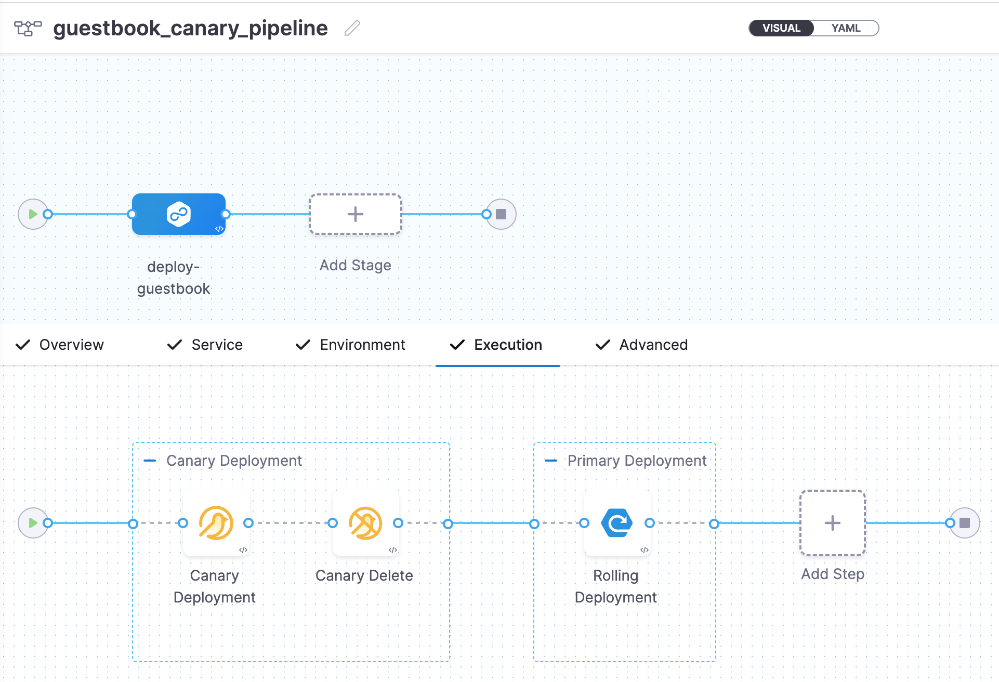

# guestbook-harness-demo

This tutorial will guide you through deploying a sample application on Kubernetes using a continuous deployment pipeline. We'll use the Harness CD pipeline to fetch an image from a registry, execute a canary deployment, and then perform a rolling deployment to launch the `guestbook` application on a Kubernetes cluster.

This tutorial assumes that the reader has foundational knowledge of Kubernetes and GitOps, or a more advanced understanding. Here is a [related resource](https://www.harness.io/learn/use-cases/kubernetes).

## Before you begin

In order to follow this tutorial, you need some prerequisites.

1. [Fork this repository](https://github.com/dewandemo/guestbook-harness-demo/fork).
2. [Sign up for free on Harness platform](https://app.harness.io/auth/#/signup/?module=cd&utm_source=github&utm_medium=github-tutorial&utm_campaign=dewan-devrel).
3. Create a GitHub personal access token with the repo scope. [Fine-grained personal access token (in beta at the time of writing this tutorial)](https://docs.github.com/en/authentication/keeping-your-account-and-data-secure/managing-your-personal-access-tokens#creating-a-fine-grained-personal-access-token) allows you many advantages over the [classic personal access token](https://docs.github.com/en/authentication/keeping-your-account-and-data-secure/managing-your-personal-access-tokens#creating-a-personal-access-token-classic). Be sure to save the token after creating it since you won't be able to see it again.
4. Have a self-hosted or managed Kubernetes cluster. We recommend [k3d](https://k3d.io/) for installing Harness Delegates and deploying a sample application in a local development environment. Read more about [Harness delegate](https://developer.harness.io/docs/platform/delegates/delegate-concepts/delegate-overview/) and [delegate system requirements](https://developer.harness.io/docs/platform/Delegates/delegate-concepts/delegate-requirements).
5. [Sign up for a docker hub account](https://hub.docker.com/) to be able to push and manage container images. You can use any other image registry. For this tutorial, we'll be using docker hub.
6. Install the [Helm CLI](https://helm.sh/docs/intro/install/) in order to install the Harness Helm delegate.
7. Please familiarize yourself with [Harness key concepts](https://developer.harness.io/docs/getting-started/learn-harness-key-concepts).

> [!WARNING]  
> For the pipeline to run successfully, please follow the remaining steps as they are, including the naming conventions.

## Configuring Harness CD

1. Log in to [Harness](https://app.harness.io/).
2. You might already be under **Default Project**. If not, switch to **Default Project** from **Projects** section.

### Delegate installation

<details>
<summary>What is the Harness delegate?</summary>
<br>
The Harness delegate is a service that runs in your local network or VPC to establish connections between the Harness Manager and various providers such as artifacts registries, cloud platforms, etc. The delegate is installed in the target infrastructure, for example, a Kubernetes cluster, and performs operations including deployment and integration. Learn more about the delegate in the <a href=https://developer.harness.io/docs/platform/delegates/delegate-concepts/delegate-overview>Delegate overview</a>.
</details>

Under **Project Setup**, select **Delegates**. If there's no existing delegate, you can select **Install a delegate**. For subsequent ones, choose **New Delegate**.

For this tutorial, let's explore how to install a delegate using Helm.

> [!NOTE]  
> Ensure you're connected to a Kubernetes cluster before running the commands below.

1. Add the Harness Helm chart repo to your local helm registry using the following commands.

```shell
helm repo add harness-delegate https://app.harness.io/storage/harness-download/delegate-helm-chart/
```

2. Update the repo:

```shell
helm repo update harness-delegate
```

3. In the following example command, ACCOUNT_ID and MANAGER_ENDPOINT are auto-populated values that you can obtain from the delegate installation wizard. Be sure to use the latest `delegateDockerImage` value which can also be found from the delegate installation wizard.

```shell
helm upgrade -i helm-delegate --namespace harness-delegate-ng --create-namespace \
harness-delegate/harness-delegate-ng \
 --set delegateName=helm-delegate \
 --set accountId=ACCOUNT_ID \
 --set managerEndpoint=MANAGER_ENDPOINT \
 --set delegateDockerImage=harness/delegate:23.03.78904 \
 --set replicas=1 --set upgrader.enabled=false \
 --set delegateToken=DELEGATE_TOKEN
```

4. Select **Verify** to verify that the delegate is installed successfully and can connect to the Harness Manager.

### Secrets

<details>
<summary>What are Harness secrets?</summary>
<br>
Harness offers built-in secret management for encrypted storage of sensitive information. Secrets are decrypted when needed, and only the private network-connected Harness delegate has access to the key management system. You can also integrate your own secret manager. To learn more about secrets in Harness, go to <a href=https://developer.harness.io/docs/platform/Secrets/Secrets-Management/harness-secret-manager-overview/>Harness Secret Manager Overview</a>.
</details>

Under **Project Setup**, select **Secrets**.

1. Create Harness secret for GitHub.

- Select **New Secret**, and then select **Text**.
- Enter the secret name `harness_gitpat`.
- For the secret value, paste the GitHub personal access token you saved earlier.
- Select **Save**.

2. Create Harness secret for Docker Hub.

- Select **New Secret**, and then select **Text**.
- Enter the secret name `docker_secret`.
- For the secret value, either use your docker hub password or [access token](https://docs.docker.com/docker-hub/access-tokens/) (recommended).
- Select **Save**.

### Connectors

<details>
<summary>What are connectors?</summary>
<br>
Connectors in Harness enable integration with 3rd party tools, providing authentication and operations during pipeline runtime. For instance, a GitHub connector facilitates authentication and fetching files from a GitHub repository within pipeline stages. Explore connector how-tos <a href=https://developer.harness.io/docs/category/connectors/>here</a>.
</details>

In your Harness project in the Harness Manager, under **Project Setup**, select **Connectors**.

1. Create the **GitHub connector**.

   - Copy the contents of [github-connector.yml](harnesscd-pipeline/github-connector.yml).
   - Click **New Connector** under **Connectors**.
   - Select **Create via YAML Builder** and paste the copied YAML.
   - Assuming you have already forked this repository, replace `GITHUB_USERNAME` with your GitHub account username in the YAML.
   - In `projectIdentifier`, verify that the project identifier is correct. You can see the Id in the browser URL (after `account`). If it is incorrect, the Harness YAML editor will suggest the correct Id.
   - Select **Save Changes** and verify that the new connector named **harness_gitconnector** is successfully created.
   - Finally, select **Connection Test** under **Connectivity Status** to ensure the connection is successful.

2. Create the **Docker connector**.

   - Copy the contents of [docker-connector.yml](harnesscd-pipeline/docker-connector.yml).
   - Click **New Connector** under **Connectors**.
   - Select **Create via YAML Builder** and paste the copied YAML.
   - Replace `username` with your Docker Hub username in the YAML.
   - Replace `YOUR_ACCOUNT_ID` with your Harness account ID. You can obtain your Harness account ID from the URL in your browser when you are logged into Harness `https://app.harness.io/ng/account/<YOUR_ACCOUNT_ID>`.
   - In `projectIdentifier`, verify that the project identifier is correct. You can see the Id in the browser URL (after `account`). If it is incorrect, the Harness YAML editor will suggest the correct Id.
   - Select **Save Changes** and verify that the new connector named **harness_docker_connector** is successfully created.
   - Finally, select **Connection Test** under **Connectivity Status** to ensure the connection is successful.

3. Create the **Kubernetes connector**.
   - Copy the contents of [kubernetes-connector.yml](harnesscd-pipeline/kubernetes-connector.yml).
   - Click **New Connector** under **Connectors**.
   - Select **Create via YAML Builder** and and paste the copied YAML.
   - Replace **DELEGATE_NAME** with the installed Delegate name. To obtain the Delegate name, navigate to **Project Setup**, and then **Delegates**.
   - Select **Save Changes** and verify that the new connector named **harness_k8sconnector** is successfully created.
   - Finally, select **Connection Test** under **Connectivity Status** to verify the connection is successful.

### Environment

<details>
<summary>What are Harness environments?</summary>
<br>
Environments define the deployment location, categorized as Production or Pre-Production. Each environment includes infrastructure definitions for VMs, Kubernetes clusters, or other target infrastructures. To learn more about environments, go to <a href=https://developer.harness.io/docs/continuous-delivery/x-platform-cd-features/environments/environment-overview/>Environments overview</a>.
</details>

1. In your Harness project, select **Environments**.

   - Select **New Environment**, and then select **YAML**.
   - Copy the contents of [environment.yml](harnesscd-pipeline/environment.yml), paste it into the YAML editor, and select **Save**.
   - In your new environment, select the **Infrastructure Definitions** tab.
   - Select **Infrastructure Definition**, and then select **YAML**.
   - Copy the contents of [infrastructure-definition.yml](harnesscd-pipeline/infrastructure-definition.yml) and paste it into the YAML editor.
   - Select **Save** and verify that the environment and infrastructure definition are created successfully.

### Services

<details>
<summary>What are Harness services?</summary>
<br>
In Harness, services represent what you deploy to environments. You use services to configure variables, manifests, and artifacts. The Services dashboard provides service statistics like deployment frequency and failure rate. To learn more about services, go to <a href=https://developer.harness.io/docs/continuous-delivery/x-platform-cd-features/services/services-overview/>Services overview</a>.
</details>

1. In your Harness project, select **Services**.

- Select **New Service**.
- Enter the name `harnessguestbook`.
- Select **Save**, and then **YAML** (on the **Configuration** tab).
- Select **Edit YAML**, copy the contents of [service.yml](harnesscd-pipeline/service.yml), and paste the into the YAML editor.
- Select **Save**, and verify that the service **harness_guestbook** is successfully created.

If you observe the [guestbook-ui-deployment.yaml file](k8s-manifests/templates/guestbook-ui-deployment.yaml), you'll see that the container image tag is templated to come from a [values.yml file](k8s-manifests/values.yml). We have not configured the variable in Harness pipeline yet to pass this value during pipeline runtime. For now, replace the image tag on [values.yml](k8s-manifests/values.yml) from `<+pipeline.variables.imageTag>` to `v0.1-dev` (it can be any other tag you choose).

## Configuring and running Harness pipeline

### Pipeline

<details>
<summary>What are Harness pipelines?</summary>
<br>
A pipeline is a comprehensive process encompassing integration, delivery, operations, testing, deployment, and monitoring. It can utilize CI for code building and testing, followed by CD for artifact deployment in production. A CD Pipeline is a series of stages where each stage deploys a service to an environment. To learn more about CD pipeline basics, go to <a href=https://developer.harness.io/docs/continuous-delivery/get-started/cd-pipeline-basics/>Pipeline basics</a>.
</details>

There are various deployment concepts and strategies when it comes to deploying code and applications into production. In this tutorial, we'll be using Canary deployments. A canary deployment updates nodes in a single environment gradually, allowing you to use gates between increments. Canary deployments allow incremental updates and ensure a controlled rollout process. To learn more about other deployment strategies, go to [Deployment concepts and strategies](https://developer.harness.io/docs/continuous-delivery/manage-deployments/deployment-concepts).

1. In **Default Project**, select **Pipelines**.

   - Select **New Pipeline**.
   - Enter the name `guestbook_canary_pipeline`.
   - Select **Inline** to store the pipeline in Harness.
   - Select **Start** and, in the Pipeline Studio, toggle to **YAML** to use the YAML editor.
   - Select **Edit YAML** to enable edit mode, and choose any of the following execution strategies. Paste the respective YAML based on your selection.

2. Copy the contents of [canary-pipeline.yml](harnesscd-pipeline/canary-pipeline.yml).
3. In your Harness pipeline YAML editor, paste the YAML.
4. Select **Save**.

You can switch to the **Visual** editor and confirm the pipeline stage and execution steps as shown below.



Now it's time to execute your pipeline.

1. Select **Run**, and then select **Run Pipeline** to initiate the deployment.

   - Observe the execution logs as Harness deploys the workload and checks for steady state.

   - After a successful execution, you can check the deployment on your Kubernetes cluster using the following command:

   ```shell
   kubectl get pods -n default
   ```

   - To access the Guestbook application deployed by the Harness pipeline, port forward the service and access it at http://localhost:8080

   ```shell
   kubectl port-forward svc/guestbook-ui 8080:80
   ```

But... this is manual execution of our CD pipeline. Let's try to automate this using triggers.

### Triggers

<details>
<summary>What are Harness triggers?</summary>
<br>
A trigger is typically an event or condition that initiates or starts a specific workflow or process. For instance, a trigger in the Harness platform might kick off a pipeline execution when a new artifact is detected in a repository or when a new Docker image is pushed to a registry. To learn more about triggers, go to <a href=https://developer.harness.io/docs/category/triggers/>Triggers overview</a>.
</details>

In this tutorial, we'll configure the CD pipeline so that it's triggered every time there's a docker image pushed to a specific docker hub image repository.

1. In **Default Project**, select **Pipelines** and then select **guestbook_canary_pipeline**.
2. Select **Triggers** and then click **New trigger**.
3. Choose **Docker Registry** under **Artifact** and toggle to **YAML** to use the YAML editor.
4. Copy the contents of [docker-trigger.yml](harnesscd-pipeline/docker-trigger.yml), and paste it in the editor.
5. Be sure to replace `DOCKER_USERNAME` with your docker hub username and `DOCKER_REPOSITORY` with a repository name of your choice. It's ok if this repository does not exist yet.
6. Select **Save**.

Now you'll need to push an image to your docker hub image repository to trigger the Harness CD pipeline.

Let's use an existing image for the guestbook application.

- Pull down the public image for the guestbook application.

```shell
docker pull gcr.io/heptio-images/ks-guestbook-demo:0.1
```

- Tag it with your docker hub username and repository name.

```shell
docker tag gcr.io/heptio-images/ks-guestbook-demo:0.1 DOCKER_USERNAME/DOCKER_REPOSITORY:TAG
```

Make sure to substitute `DOCKER_USERNAME`, `DOCKER_REPOSITORY`, and `TAG` in the above and following commands. For example, I tagged the image as `dewandemo/guestbook:v0.1-dev`.

- Push the image.

```shell
docker push DOCKER_USERNAME/DOCKER_REPOSITORY:TAG
```

> [!NOTE]  
> If you want to trigger on all artifacts collected during polling interval, you'll need to toggle the feature flag `TRIGGER_FOR_ALL_ARTIFACTS`. More details [here](https://developer.harness.io/docs/first-gen/continuous-delivery/model-cd-pipeline/triggers/trigger-a-deployment-on-new-artifact/#all-artifacts-trigger-deployment).

### Variables

<details>
<summary>What are Harness variables?</summary>
<br>
Harness variables are a way to refer to something in Harness, such as an entity name or a configuration setting. At pipeline runtime, Harness evaluates all variable expressions and replaces them with the resulting value. To learn more about Harness variables, go to <a href=https://developer.harness.io/docs/platform/variables-and-expressions/harness-variables/>Built-in and custom Harness variables reference</a>.
</details>

Let's learn how to use Harness variable to pass image tag value during pipeline runtime.

1. From **Pipeline Studio** under `guestbook_canary_pipeline`, select **Variables**.
2. Click **+ Add Variable** under the **Pipeline** section. Read more on [Variable scope](https://developer.harness.io/docs/platform/variables-and-expressions/harness-variables/#scope).
3. Leave the variable type as `String`, set the variable name `imageTag` and enter a value for the image tag. This is the same tag you used previously when pushing the docker image. If you've used the same naming convention I suggested, this value will be `v0.1-dev`.
4. Click **Save**.
5. If you hover over the newly created variable, you'll see a copy icon that'll let you reference this variable anywhere in the pipeline/stage.
6. Revert the change you previously made under [values.yml](k8s-manifests/values.yml) and switch the value for image tag to `<+pipeline.variables.imageTag>`.

For any subsequent pipeline triggers, the image tag will be dynamically passed rather than hardcoded value.

> [!NOTE]  
> Ensure that an image with the specified dynamic image tag exists on your container image repository.
